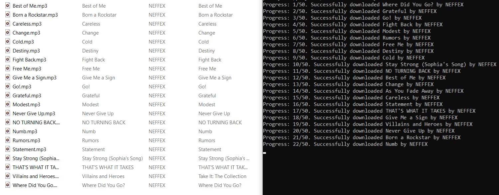
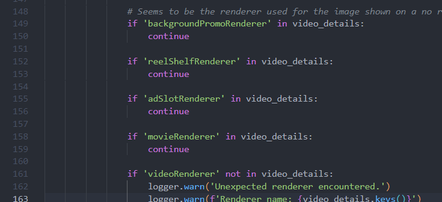
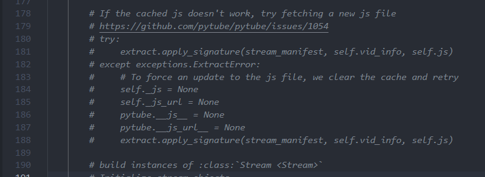

# SpotifyDownloader

Welcome to this repository! My program allows you to download playlists and songs from Spotify absolutely free (you don’t need Spotify premium to use the program, it doesn’t even need to know anything about your personal account, to be honest).

### Preview:


## Features

- **Playlists**: Download Spotify playlists with just 1 url
- **Songs**: Download Spotify song with just 1 url
- **Metadata**: All needed metadata from songs downloads with them (including name, artists, album and cover art)
- **Cutting**: You can "cut out" the piece of your playlist your want by using flags when run the program
- **Progress tracking**: You don't have to sit in front of your computer and check if each song has been downloaded - program inform you about progress after every song downloaded so you can check it all later.
- **Safety**: You don't need to worry about songs that have the same name or that song has age restriction etc. This program cares for all of this (though, there still might be unexpecting errors but program will inform you about this)
> [!IMPORTANT]
> If you encounter any problem, don't be afraid to report it in the bugs and issues section of this repository.

## Repository

Explore the source code and contribute to the development on GitHub:

[](https://github.com/Heir-of-God/SpotifyDownloader)

## Installation

Follow these steps to set up the SpotifyDownloader on your local machine:

1. **Give a star this repo if you find it interesting or useful**⭐\
    **Thanks ❤️**

2. **Clone the repository**:

   ```bash
   git clone https://github.com/Heir-of-God/SpotifyDownloader
   ```

3. **Install dependencies**:

   ```bash
   pip install -r requirements.txt
   ```
4. **Create Spotify API**: \
    To grab information from Spotify you need Spotify API app. Here how to create it in 3 steps:
    1. Go to https://developer.spotify.com/. Create or login into your account.
    2. After agreeing to all their requirements, you need to create the application. Click on your profile -> Dashboard -> Create app. Enter any app name, description, left website empty and add to redirect URIs just http://localhost/. In API choose only "Web API" and click save.
    3. After creating app go to its page, click settings and from "Basic Information" you will need cliend id and client secret. Go to the next step with this information.

5. **Set up environment variables**:
   - Create a `.env` file in the root directory.
   - Define the following environment variables:
     - `CLIENT_ID`: Copy there your client_id from Spotify API
     - `CLIENT_SECRET`: Copy there your client_secret from Spotify API

6. **VERY IMPORTANT**: \
    If you want program to work correctly you will need to change PyTube's source code a bit. I'm sorry, I have nothing to do with it and have struggled to fix their "bugs" as I could.
    1. You need to add some lines of code in search.py. Add this at line 151:
    ```python
    if 'reelShelfRenderer' in video_details:
        continue

    if 'adSlotRenderer' in video_details:
        continue

    if 'movieRenderer' in video_details:
        continue
    ```
    

    2. You need to document or delete some lines of code in \_\_main\_\_.py like this (from 177 to 190):

    

After completing these steps, you'll have the SpotifyDownloader ready to use locally.

## Usage

1. The program is CLI (Command Line Interface) so you will need basic knowledge about cmd or bash or whatever you will use as a command line.
2. Run your command line and go to the root directory of SpotifyDownloader
3. Run and check all information about CLI interface.
   ```bash
   py SpotifyDownloader.py -h
   ```
   Run your first downloading and enjoy results :)

## Contributing

Contributions welcome! Open issues or submit pull requests.

## License

This project is licensed under the BSD 3-Clause License - see the [LICENSE](LICENSE) file for details.
